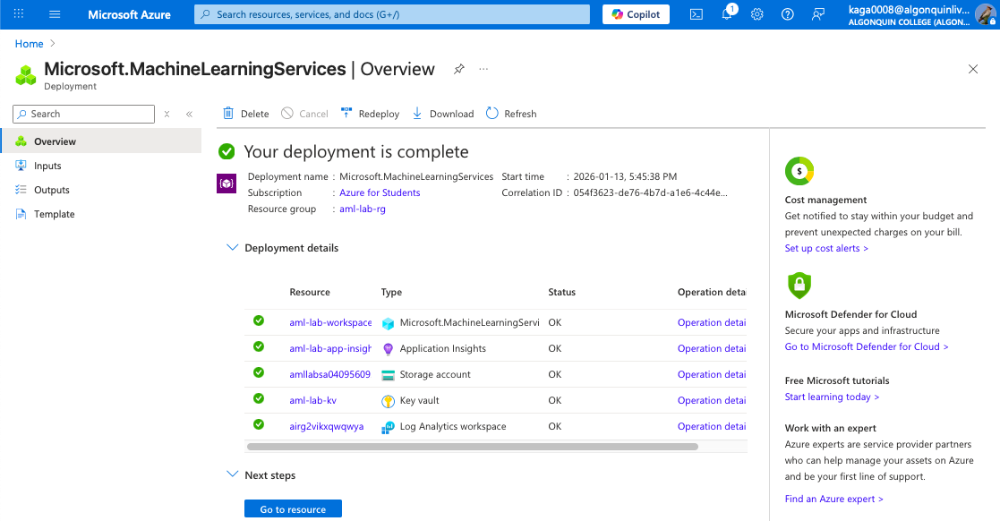
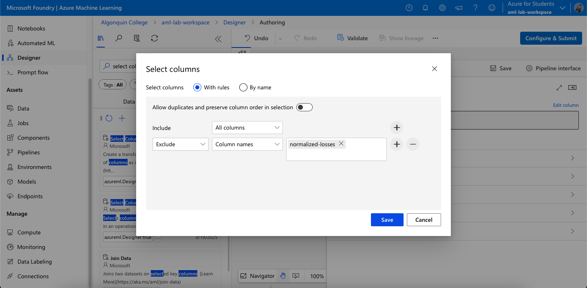
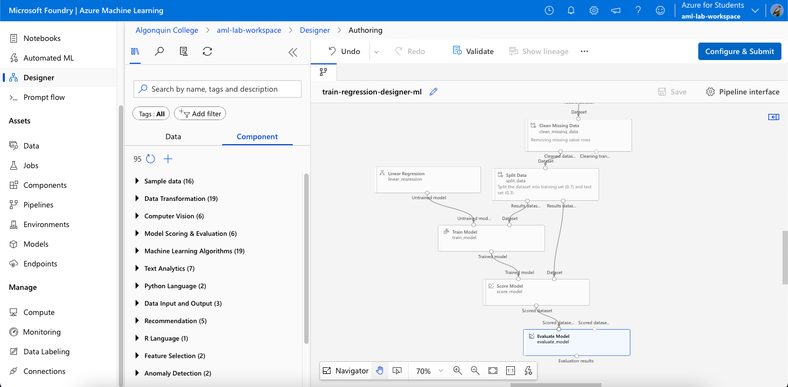
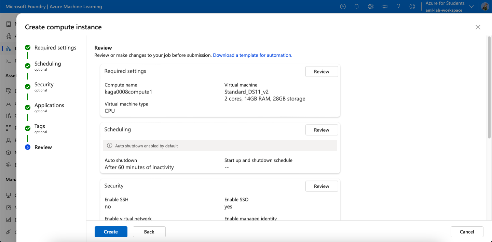
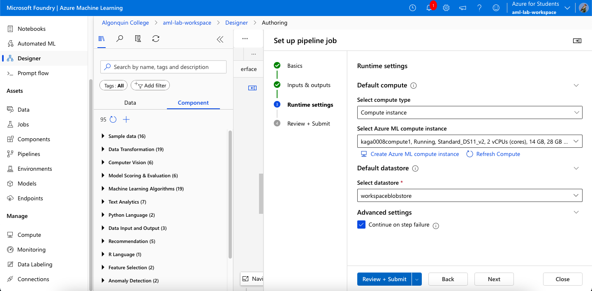
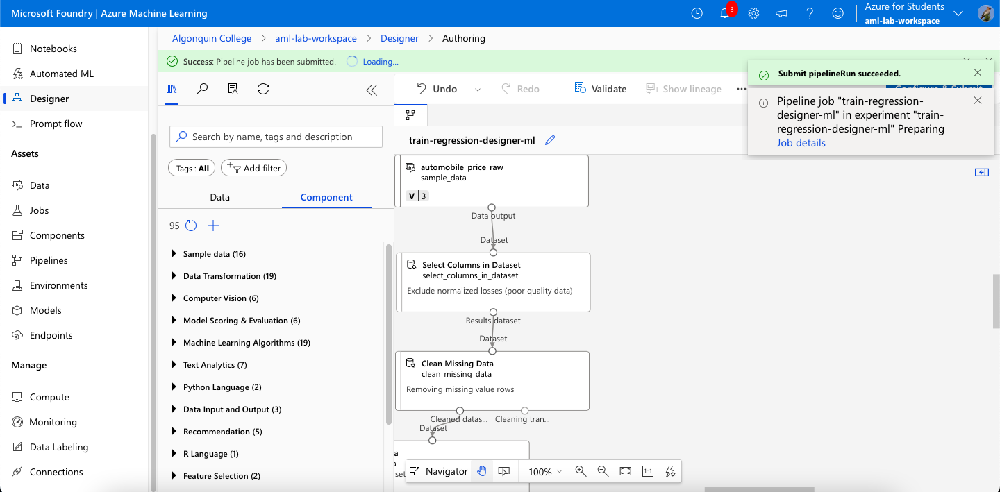
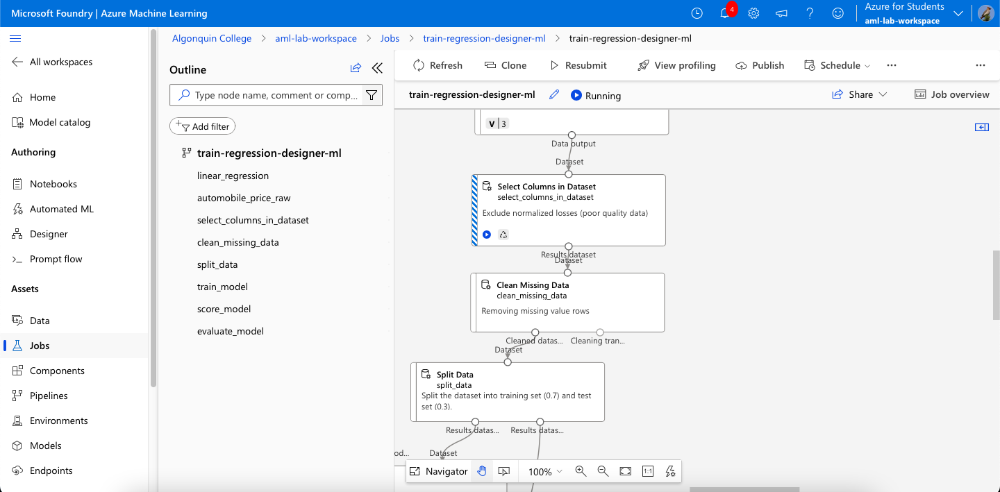
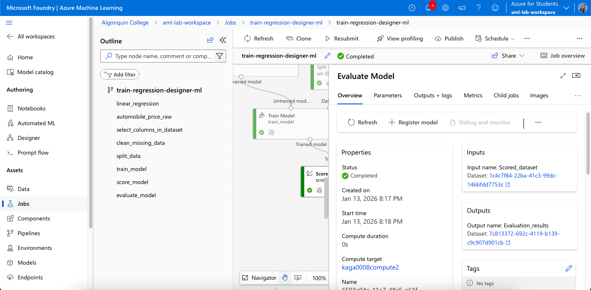
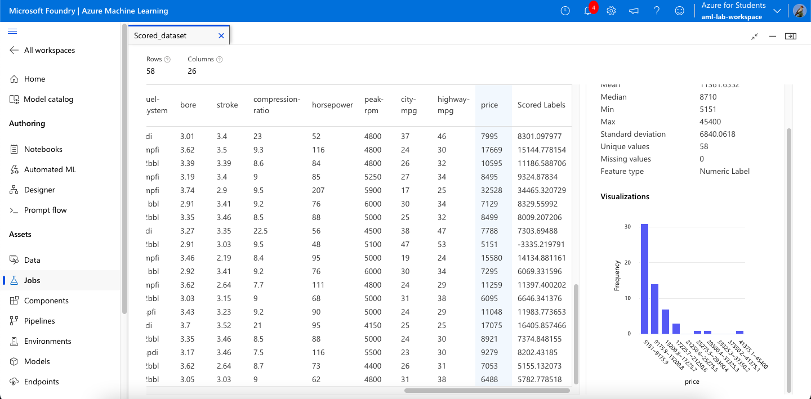
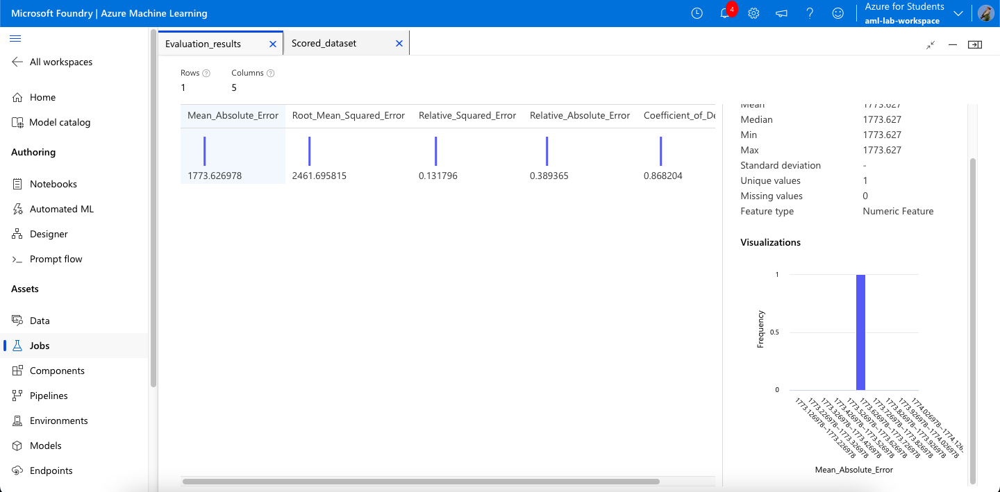

# CST8921 Lab 1: AI and ML
## Elizabeth Kaganovsky (040956095)

### 1. Establishing Resource Group

Straightforward and in accordance with instructions.

### 2. Configuring Pipeline

Beginning to build the pipeline as per the Microsoft Learn guidelines. This screenshot shows the configuration of the "Select Columns" component, which is used to prepare the data by discarding a column where many rows lack entries.

### 3. Assembling the Pipeline Further

A Component is added to split the data, and a model is added as well. In addition to the model are components for trading, scoring based on the previously split data, and evaluating the model's accuracy.

### 4. Setting Up a Pipeline Job

Creating the pipeline job. When I ran into errors and the job would fail, disabling the "continue on step failure" helped isolate the issue.

### 5. Running the Pipeline

The assembled pipeline is run. All components are executed sequentially. Initially I ran into issues and had a few failed runs I could not parse the cause of--after double checking everything in the affected part of the process, what fixed it was simply deleting and replacing the original data component with no changes.

### 6. Pipeline Completion and Evaluation

The job is run, the model is trained, and the scored dataset and evaluation results are generated.